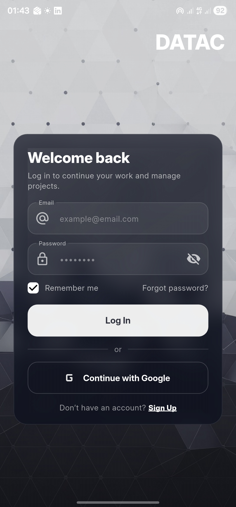

# 📱 DATAC — Flutter Mobile App

A modern **Flutter mobile application** with sleek UI, built using Dart and following best practices.  
This app includes dashboard screens, project management actions, and navigation features.

---

## 🚀 Features

✨ Beautiful responsive dashboard  
🧠 Modern dark UI with glassmorphism effects  
🗂️ Navigation drawer  
📊 Summary and interactive cards  
📁 Screens for:
- New Project
- Upload Resource
- View Projects
- Account Settings

🔧 Works on:
✔ Android  
✔ iOS  
✔ Web  
✔ Desktop (Windows, macOS, Linux)

---

## 📸 Screenshots

  
*Add screenshots of your UI here*

---
lib/
├── screens/ # All screen UI code
├── widgets/ # Reusable custom widgets
├── main.dart # App entry point
assets/
├── images/ # All image assets
android/
ios/


---

## 🧠 Tech Stack

- **Flutter**  
- **Dart**  
- Responsive UI  
- Modern design tokens  
- GlassCard Widget (Glassmorphism)

---

## 📥 Getting Started (Run Locally)

### Requirements
🔹 Flutter SDK installed  
🔹 Android Studio / VS Code set up  

### Steps

1. Clone the repository

```bash
git clone https://github.com/sudharaka2010/datac-mobile-app.git


## 📦 Project Structure

